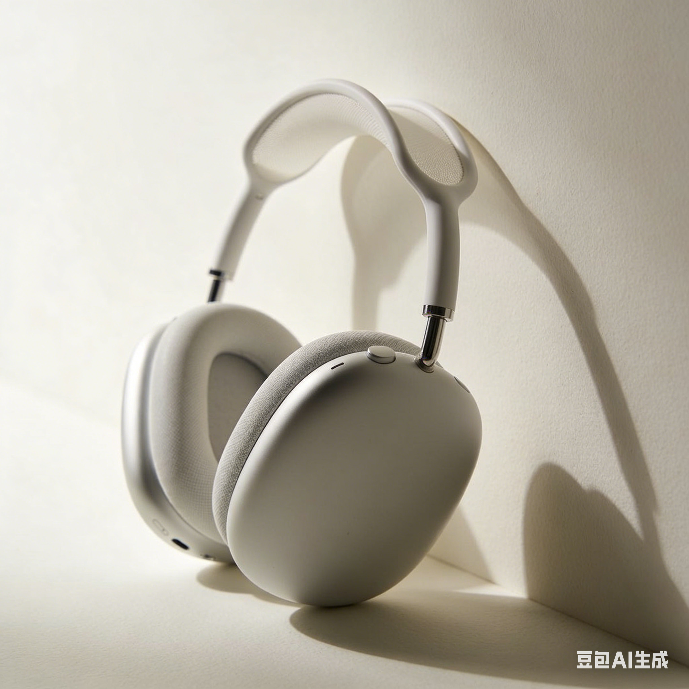
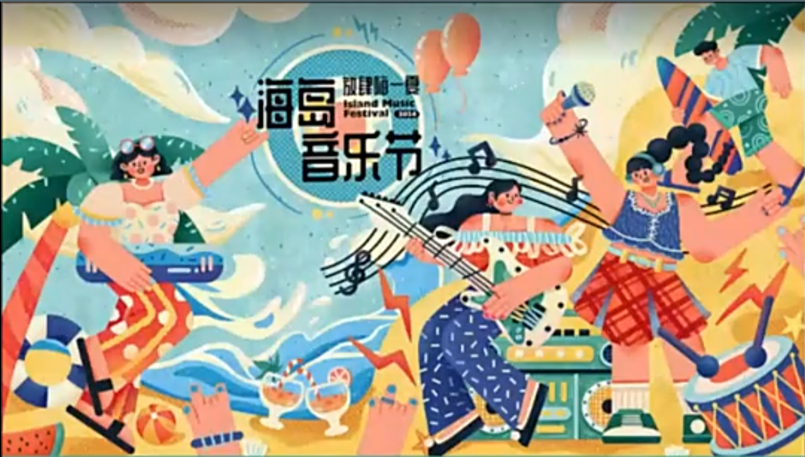
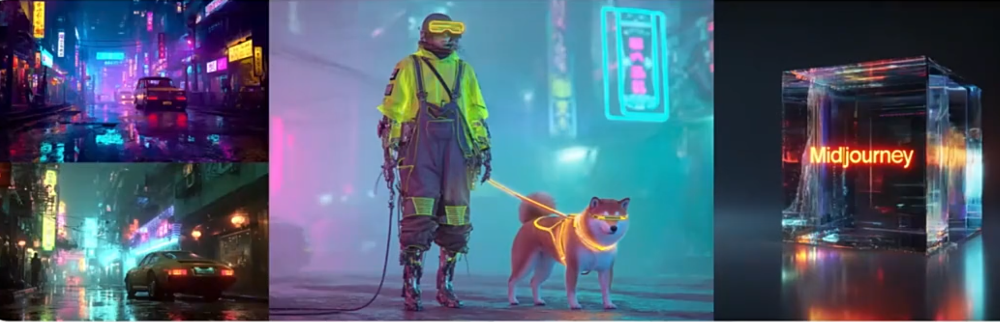
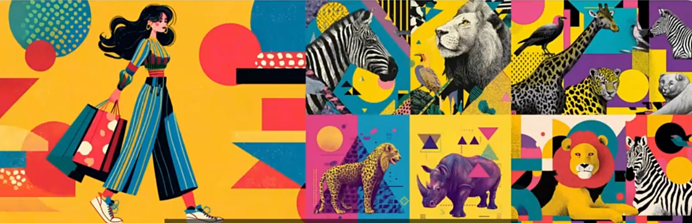
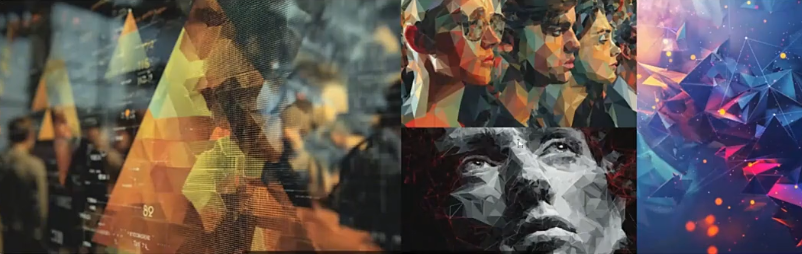
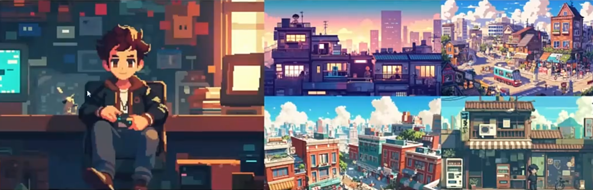

# AI绘画在商业海报中的运用


## 高频风格及对应关键词体系

### 极简主义（Minimalist）

- 参考图：

  

- 代表人物：原研哉（kenya Hara）（はら けんや）

- 风格特点：

  - 大量留白
  - 几何图形
  - 强调“少即是多”的视觉哲学

- MJ关键词实例:

  ```jsx
  /imageine prompt:Minimalist commercial poster,geometric composition, 80& white space,clean lines,productcentered,by Kenya Hara
  ```

### 扁平插画（Flat design）

- 参考图

  

- 代表人物：当代信息图标设计（information Graphics）、Google Material Design

- 风格特点：

  - 无渐变阴影的色块组合
  - 无阴影渐变
  - 符号化图形
  - 高饱和色块

- MJ关键词实例：

  ```jsx
  /imagine prompt：Flat illustration poster，solid color blocks，2px outline
  ```

### 赛博朋克（cyberpunk）

- 参考图：



- 代表人物：Beeple
- 风格特点：
  - 霓虹光效与破败场景的反差
  - 全息投影元素
  - 蓝紫/红绿对比色
  - 机械义体
  - 故障艺术
- MJ关键词实例：

```jsx
/imagine prompt:Cyberpunk commercial poster,neon lights,holographic display,rain-soaked streets,Blade runner aesthetic,by beeple
```

### 孟菲斯风格（Memphis Style）

- 参考图：



- 代表人物：Memphis group

- 风格特点：

  - 集合拼贴
  - 波普元素
  - 几何图案重复排列
  - 高饱和撞色，不对称平衡

- MJ关键词实例：

  ```jsx
  /imagine prompet:Memphis sytle poster,geometric patterns, blod color contrast, asymmetric balance,1980s retro
  ```

适合潮流消费品包装盒儿童产品宣传

### 水彩插画风（Watercolor）

- 参考图：


- 代表人物：
  - Sophie Blackall
  - 杨诘苍（当夜水墨艺术家）
  - 齐白石（花鸟画
  - 张大千（全能型画家：泼墨泼彩技法，山水，人物，花卉）
  - 范曾（泼墨人物画）
- 风格特点：晕染效果，自然笔触，柔和过渡，水墨笔触与现代构图结合
- MJ关键词实例：

```jsx
/imagine prompt:watercolor illustration, soft brush strokes,color blending,textured paper/ Neo-Chinese ink painting,brush strok texture,by Sophie blackall/Yang Jiechang/Qi Baishi/Zhang Daqian/Fan Zeng
```

### 蒸汽波风格（Vaporwave）

- 参考图：

  


- 代表人物：Retro futurism

- 风格特点：

  - 故障艺术风格
  - 希腊雕塑元素
  - 粉紫渐变背景

- MJ关键词实例：

  ```jsx
  /imagine prompt:Vaporwave commercial poster,glitch art effect,pink purple gradient,retro 80s
  ```

### 低多边形（Low Poly)

- 参考图：

  

- 代表人物：Robert Hodgin

- 风格特点：三角形面构成整体造型，定点数量控制在500-1500个

- MJ关键词实例：

  ```jsx
  /imagine prompt：Low poly commercial poster,triangular faces,tech conference,data visualization,by Robert Hodgin
  ```

### 像素艺术风格（Pixel Art)

- 参考图



- 代表人物：Jonas De Ro

- 风格特点：

  - 低分辨率点阵
  - 8-bit游戏美学
  - 锯齿边缘

- MJ关键词实例：

  ```jsx
  /imagine prompt：pixel art, 8-bit style,retro game graphics,blocky characters
  ```

## IP设计的多角度试图标准化流程

## 如何设计一个完整IP角色

基础造型

### 基础造型

输入主体描述

正面视角”Front view”

对称“symmetrical”

全身“full body”

无透视变形“—no perspective distortion”

### 多角度视图制作

侧面视角“Profile view”

侧轮廓“Side profile”

```jsx
tow views:front view and profile view, a cut panda character dressed in an astronaut uniform, full body, featuring a white and orange color scheme, with a round body and big eyes, maintaining consistent proportions --ar 3:2 --no perspective distortion
```

### 盲盒设计

核心基因设定

基础题型：【物种】character,[体型特征]，consistent body structure

关键词：

chubby body :Q版

big head

facial expression library 面部表情库

## icon图标设计及商业呈现规范

### 2.5D风格icon

基础形状：

等距2.5D图标（Isometric 2.5D icon),[对象名称]几何图形（geometric shape）45°角（45 degree angle）

体积构建：

添加depth effect， 10px extrusion，渐变从（色值范围）（gradient from #XXXXX to #XXXXX）

细节参数：

阴影角度固定为135°，模糊半径2px

### 毛玻璃风格icon

基底制作：

毛玻璃风格图标（Frosted glass icon），[对象]，透明背景（transparent background），模糊边缘（blurred edges）

质感参数

玻璃效果（glass effect），70°透明度（80% transparent），光影反射（light reflection）

色彩系统

采用白透明RGBA值（如rgba（255，255,255,0.7））叠加1px白色内描边

## 扁平风格icon

轮廓规范：扁平风（Flat design icon),[]2个像素宽度的线条（2px line weight）,纯色 （solid color）

色彩标准：单一主色+白色（#FFFFFF)点缀

简化原则：保留3-5个核心识别元素，去除次要细节